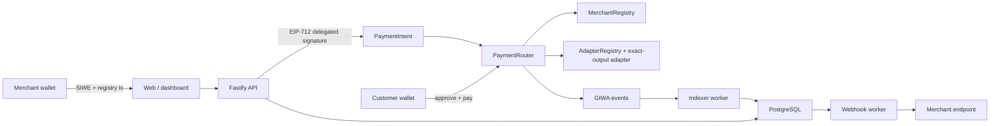

# GiwaPay

> **Pay with anything. Settle exactly.**

사용자는 가진 자산으로 결제하고, 판매자는 선택한 자산과 정확한 금액으로
정산받는 GIWA 기반 비수탁 결제 레이어입니다.

GiwaPay is a testnet-only MVP implementation for non-custodial payment orchestration.
A customer approves and pays with a configured ERC-20 asset; one atomic
`PaymentRouter` transaction obtains the exact settlement output, distributes a
registry-owned merchant split, pays the fixed platform fee, and refunds unused
input. The backend accepts success only after its independent,
confirmation-aware indexer verifies the canonical router event.

## Why GIWA

GiwaPay is built for GIWA because the product and the ecosystem roadmaps point
in the same direction:

- **A practical EVM execution layer now.** GIWA documents an OP Stack-based,
  EVM-compatible chain with one-second blocks and low fees, so the Solidity,
  viem, and wallet boundaries in this repository work without inventing a
  proprietary runtime.
- **A credible payment surface next.** GIWA's official roadmap describes a
  self-custody wallet and a stablecoin ecosystem that includes a stable
  paymaster. GiwaPay supplies a merchant layer: signed payment
  requests, exact settlement, registered recipients, and independently
  verified receipts.
- **GIWA-native trust primitives later.** Dojang attestations and Upbit Web3
  Names create a documented path toward an address-level identity signal
  without putting personal information into the PaymentIntent. Business and
  merchant verification would remain a separate product and compliance step.

These are product-fit reasons, not integration claims. GIWA mainnet and GIWA
Wallet remain under development; the current MVP targets GIWA Sepolia, uses
standard EIP-1193/EIP-6963 wallet interfaces, and does not connect to the Upbit
exchange service. See the official [GIWA introduction](https://docs.giwa.io/),
[Dojang](https://docs.giwa.io/giwa-chain/en/giwa-ecosystem/dojang),
[up.id](https://docs.giwa.io/giwa-chain/en/giwa-ecosystem/giwa-id), and
[testnet terms](https://docs.giwa.io/giwa-chain/en/terms-and-policies/testnet-terms-of-use).

Public review links:

- showcase: <https://giwapay-mvp.eomyunsig.chatgpt.site>
- source: <https://github.com/eomyunsig-debug/giwapay>
- GASOK application brief: [docs/gasok-application.md](docs/gasok-application.md)
- GASOK technical one-pager:
  [docs/gasok-one-pager.md](docs/gasok-one-pager.md)
- proposed wallet in-app mode:
  [docs/giwa-wallet-embedded-mode.md](docs/giwa-wallet-embedded-mode.md)
- two-minute demo script: [docs/submission-demo.md](docs/submission-demo.md)
- market model and pilot plan:
  [docs/market-opportunity.md](docs/market-opportunity.md)
- portable market decision report:
  [docs/market-report/report.html](docs/market-report/report.html)

The public showcase is intentionally non-transactional. It does not imply that
GIWA Sepolia contracts or the payment backend are live.

This repository is **not audited or production-ready**, has no official GIWA
partnership, and makes no claim of fiat, gasless, regulatory, mainnet, or
production-DEX support.

## What the MVP includes

- SIWE merchant login for EOAs and ERC-1271 contract wallets, with short-lived,
  single-use nonces, secure session cookies, origin checks, and CSRF protection
- one-time on-chain merchant registration and a delegated invoice signer whose
  address is contract-enforced to differ from the merchant admin, current
  payout address, and refund operator
- scoped API keys stored as peppered HMAC-SHA-256 digests, with plaintext
  displayed once and a non-secret prefix retained for identification
- typed, idempotent PaymentIntent REST API, hosted checkout links, and QR codes
- injected EIP-1193/EIP-6963 wallets; optional WalletConnect only when configured
- direct-token and allow-listed exact-output adapter payments
- exact merchant settlement, immutable platform-fee policy, and registered
  split templates with at most eight recipients
- independent event/receipt verification, confirmation depth, reorg rollback,
  PostgreSQL projections, signed webhooks with retries, and a bounded retention
  worker
- full and partial merchant-funded on-chain refunds with replay-resistant
  `(merchant, intentId, refundId)` identities
- merchant dashboard, verifiable receipts, TypeScript SDK, React component, and
  example store
- local Anvil demo, opt-in GIWA Sepolia deployment, Docker, CI, Slither, and a
  Tailscale-compatible release workflow

## System boundary



There is no intermediate GiwaPay balance. Collection, optional swap,
distribution, platform fee, and unused-input refund either all complete or all
revert in the same transaction. Refunds are separately funded by the merchant
admin or its registered refund operator. Once executable refund calldata is
issued, the API cannot revoke it off-chain. A pending refund can only be resumed
with the same `(merchant, intentId, refundId)` identity until a canonical event
settles its state.

For a successful payment, the indexer verifies every canonical
`SettlementDistributed` log in the payment receipt and stores the verified
recipient/amount/basis-point distribution as the payment-time snapshot.
Receipts do not reconstruct historical settlement from mutable current
registry state. The delegated EIP-712 signature also commits to the exact
recipient/bps snapshot through `splitHash`, so a registry edit cannot redirect
an already signed invoice.

## Repository layout

```text
apps/web              Next.js hosted checkout and merchant dashboard
apps/api              HTTP server, chain indexer, webhook, and retention workers
packages/contracts    Foundry contracts, scripts, tests, and malicious fixtures
packages/db           Drizzle schema and PostgreSQL migration
packages/chains       typed GIWA chain, RPC fallback, wallets, token registry
packages/sdk          runtime-validated TypeScript client and calldata helpers
packages/react        React provider, hooks, and checkout button
packages/ui           shared accessible UI primitives
packages/config       secure extension interfaces and runtime guards
examples/nextjs-store minimal merchant integration
docs                  API, security, deployment, testing, and operations
deployments           reviewed manifest locations; generated records are ignored
```

## Toolchain

- Node.js 24 LTS and pnpm 11
- Foundry 1.7, Solidity 0.8.28, OpenZeppelin Contracts 5.4
- PostgreSQL 18, Fastify 5, Drizzle, Next.js 16, React 19, wagmi, and viem

Dependencies are exact in `pnpm-lock.yaml`; Solidity libraries are pinned git
submodules.

## Local end-to-end demo

Prerequisites: Docker with Compose, Foundry (`forge` and `cast`), Node.js,
pnpm, and an injected browser wallet. No public-chain credential is used.

```sh
git submodule update --init --recursive
pnpm install --frozen-lockfile
pnpm demo:up
```

The command:

1. creates a private, ignored `.env.demo` with new local-only secrets;
2. starts PostgreSQL and Anvil on chain ID `91342`;
3. deploys the registries, router, three labelled mock tokens, faucet, and mock
   exact-output adapter through Anvil's unlocked account;
4. runs migrations and starts the API, indexer, webhook worker, and web app.

Open:

- web: <http://127.0.0.1:3000>
- live OpenAPI UI: <http://127.0.0.1:3001/docs>
- health: <http://127.0.0.1:3001/health>
- readiness: <http://127.0.0.1:3001/ready>

Fund only a **public address** from the local chain:

```sh
./scripts/fund-demo-wallet.sh 0xYourPublicWalletAddress
```

This grants local test ETH, MockKRW, MockUSDC, and MockALT without reading or
printing a private key. In the wallet, use RPC `http://127.0.0.1:8545` with
chain ID `91342`; if the wallet already stores GIWA Sepolia under that ID,
temporarily switch its RPC for the isolated demo. All mock assets are displayed
as “Testnet demo” and have no monetary value.

Stop the disposable demo and remove its database volume:

```sh
pnpm demo:down
```

See [local-demo.md](docs/local-demo.md) for the full acceptance walkthrough.

## Development and verification

```sh
pnpm install --frozen-lockfile
pnpm audit --prod
pnpm format:check
pnpm lint
pnpm typecheck
pnpm test
pnpm build
```

Focused contract assurance:

```sh
pnpm --filter @giwapay/contracts test:ci
pnpm --filter @giwapay/contracts test:gas
```

Browser tests:

```sh
pnpm --filter @giwapay/web exec playwright install chromium
pnpm test:e2e
```

PostgreSQL-backed integration tests require `TEST_DATABASE_URL`. The dedicated
Anvil flow additionally uses `RUN_ANVIL_INTEGRATION=true`, a loopback Anvil RPC
and a local deployment manifest:

```sh
pnpm --filter @giwapay/api test:anvil
```

With its test-only environment enabled, that suite executes merchant
registration, SIWE/API-key setup, MockUSDC-to-MockKRW exact-output approval and
payment, confirmed indexer projection with settlement snapshot, signed delivery
to a real loopback HTTP webhook receiver, and a merchant-funded partial refund.
Without the explicit opt-in it is skipped; with opt-in enabled, a missing
required test variable fails closed. CI's dedicated
`Anvil payment flow integration` job provisions isolated PostgreSQL/Anvil
services, deploys the local contracts, and generates masked ephemeral test
secrets before running it. Details are in
[testing.md](docs/testing.md).

The ordered database history starts with the fresh-database
`0000_initial.sql` baseline. Later migrations, including the stable merchant
identity backfill, are explicit upgrade steps. Back up retained data and review
the whole pending sequence before applying it outside disposable local/CI
environments; see [deployment.md](docs/deployment.md).

## API and SDK

In local/development mode, generated OpenAPI is available at `/openapi.json`
and Swagger UI at `/docs`. Production hides both unless
`EXPOSE_API_DOCS=true` is explicitly configured. Mutating merchant-browser
requests use the SIWE session plus
`X-CSRF-Token`; server integrations use `Authorization: Bearer gwp_test_…` and
an `Idempotency-Key` for PaymentIntents and refunds.

```ts
import { GiwaPayClient } from '@giwapay/sdk';

const giwaPay = new GiwaPayClient({
  baseUrl: process.env.GIWAPAY_API_URL!,
  apiKey: process.env.GIWAPAY_API_KEY!,
});

const result = await giwaPay.createPaymentIntent({
  idempotencyKey: crypto.randomUUID(),
  description: 'Order #1042',
  settlementToken: '0x…',
  settlementAmount: '25000000',
  expiresAt: new Date(Date.now() + 15 * 60_000).toISOString(),
});

console.log(result.checkoutUrl);
```

Never put an API key in browser code. See [api.md](docs/api.md) and
[webhooks.md](docs/webhooks.md).

The configured platform fee is added to the exact merchant output and is paid
by the customer in the settlement asset. It never reduces the merchant's
signed settlement amount.

## Production signer mappings

Production defaults to PostgreSQL-backed per-merchant AWS KMS mappings through
`PAYMENT_INTENT_SIGNER_SOURCE=database`. The database stores only a KMS key
identifier and its derived public Ethereum address. After a merchant signs in
once, an operator validates and provisions its non-exportable key with:

```sh
pnpm --filter @giwapay/api signer:provision -- \
  --merchant 0x… \
  --key-id alias/giwapay-merchant-example
```

The command derives the signer address from KMS and refuses accidental
replacement or readiness-key reuse. The former JSON environment map remains
available only through explicit `PAYMENT_INTENT_SIGNER_SOURCE=environment`
compatibility. See [operations.md](docs/operations.md) for provisioning and
rotation order.

## GIWA Sepolia deployment

GIWA Sepolia is centralized in `@giwapay/chains`: chain ID `91342`, native ETH,
official public RPC `https://sepolia-rpc.giwa.io`, and explorer
`https://sepolia-explorer.giwa.io`. `GIWA_RPC_URL` and comma-separated fallback
providers override the public endpoint; transports use timeout, retry,
exponential delay, and ranked fallback.

Public deployment is deliberately opt-in and accepts only an existing encrypted
Foundry keystore account:

```sh
CONFIRM_GIWA_SEPOLIA_DEPLOY=91342 \
GIWAPAY_DEPLOYER_ACCOUNT=my-encrypted-foundry-account \
PLATFORM_FEE_RECIPIENT=0x… \
ADAPTER_MANAGER_ADDRESS=0x… \
pnpm deploy:giwa-sepolia
```

The wrapper checks the RPC-reported chain ID before broadcasting and never
accepts a raw private-key command argument. It does not deploy to Ethereum or
GIWA mainnet. Local and CI verification do not broadcast to GIWA Sepolia, and
this repository does not claim that a public deployment has occurred. Review
[deployment.md](docs/deployment.md) first.

## Security and scope

Start with [SECURITY.md](SECURITY.md), the
[threat model](docs/threat-model.md), and the
[security checklist](docs/security-checklist.md). Extension interfaces exist
for future payment methods, production DEXes, on/off-ramps, wallet providers,
paymasters, merchant verification, and x402. They are disabled boundaries—not
fake integrations.

Current technical non-goals include cards, Korean bank transfers, Upbit
account/exchange integration, fiat custody or off-ramp, a production KRW
stablecoin, bridges, subscriptions, chargebacks, mainnet, and claims about
unreleased GIWA Wallet or Stable Paymaster products. These boundaries keep the
testnet MVP honest; they do not make GiwaPay chain-agnostic or weaken the
GIWA-specific product thesis above.

## License

MIT. See [LICENSE](LICENSE).
