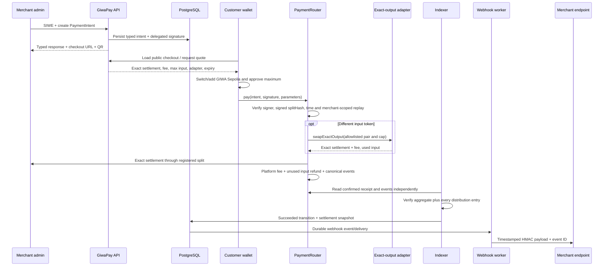

# GiwaPay architecture

GiwaPay orchestrates a payment but never holds customer or merchant funds across
transactions. The settlement contract either completes receive/swap/split/fee/
refund-unused atomically or reverts.

## Components

| Component          | Responsibility                                                                                     | Does not do                                    |
| ------------------ | -------------------------------------------------------------------------------------------------- | ---------------------------------------------- |
| `MerchantRegistry` | Admin, payout, delegated signer, refund operator, active state and registered split templates      | Sign invoices, hold funds or register adapters |
| `AdapterRegistry`  | Adapter code hash, pair, cap, test-only flag and emergency status                                  | Execute arbitrary routing or proxy upgrades    |
| `PaymentRouter`    | Verify EIP-712 intent, prevent replay, settle exact output, distribute and record refunds          | Custody funds between calls or delegatecall    |
| HTTP API           | SIWE sessions, API keys, create/read intents, public checkout projection and refund preparation    | Declare payment success                        |
| Indexer worker     | Independently read canonical blocks/events, apply confirmations and reconcile payment/refund state | Trust a browser transaction callback           |
| Webhook worker     | Claim PostgreSQL deliveries, sign, retry and dead-letter                                           | Share signing secrets with the browser         |
| Web app            | Merchant dashboard and payer checkout through the user's wallet                                    | Store wallet or delegated-signer private keys  |
| SDK packages       | Typed API, transaction encoding and React integration                                              | Hide chain verification or simulate success    |

## Payment sequence

## Truth and state transitions

`created` means an API record and a valid delegated signature exist. A submitted
transaction may be recorded for user feedback, but only an indexed canonical
event moves the intent to `succeeded`. A refund event then moves it to
`partially_refunded` or `refunded`. Reorganization handling removes
now-noncanonical confirmed facts, recomputes the affected aggregate,
invalidates undelivered success webhooks, and emits `payment.reorged` or
`refund.reorged` compensation.

`PaymentSucceeded` is necessary but not sufficient for the backend transition.
The indexer also requires the receipt's `SettlementDistributed` logs for that
intent to contain one to eight unique nonzero recipients, total 10,000 basis
points, and amounts that reproduce the router's rounding rule and exact
merchant amount. It stores those verified entries in the PaymentIntent
projection. Historical receipts and webhooks use that snapshot rather than a
later `MerchantRegistry` payout or split state.

The delegated signature also commits to
`splitHash = keccak256(abi.encode(recipients, basisPoints))`. A later registry
edit cannot silently change a pending invoice; it makes the signed snapshot
fail execution until the merchant issues a new intent.

A refund remains pending as `requested` or `submitted` after executable
calldata is issued. Resume rebuilds calldata without changing its
`(merchant, intentId, refundId)` identity. The API cannot revoke it because
signed or broadcast calldata may still execute. Only an authoritative
`Refunded` event moves the record to `succeeded`. A removed refund event moves
it back to `submitted`, dead-letters undelivered stale success notifications,
and queues `refund.reorged`.

The database enforces uniqueness for:

- merchant and idempotency key;
- globally unique API PaymentIntent IDs and composite refund IDs (the contract
  replay namespaces remain merchant-scoped);
- chain ID, transaction hash and log index;
- webhook event and endpoint delivery;
- API/session/nonce hashes.

## Extension boundaries

Production DEX routes, payment methods, on/off ramps, GIWA merchant
verification, GIWA Wallet, gas sponsorship and x402 are interfaces without fake
implementations. An extension may not bypass:

1. on-chain adapter allowlisting for any swap;
2. registered settlement recipients;
3. exact balance-delta checks;
4. independent confirmed-event verification.

## Deployment topology

HTTP API, indexer and webhook worker are separate processes sharing PostgreSQL.
The web service can be scaled independently. A GIWA RPC outage stops new quotes
and indexing safely; it must not turn a submitted transaction into an
application-level success. Deployment manifests are keyed by chain and are the
only source for contract/token addresses.
