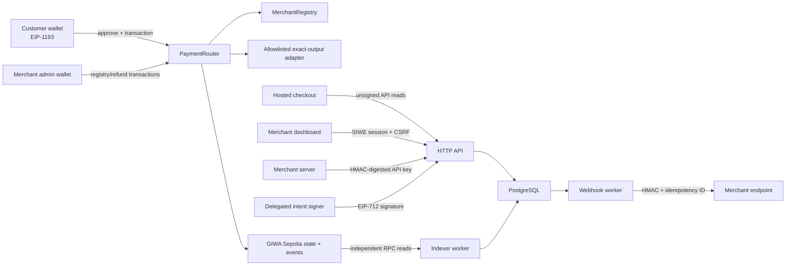

# GiwaPay MVP threat model

Status: design and implementation review for an unaudited testnet MVP.

## Assets and security objectives

| Asset                   | Objective                                                                      |
| ----------------------- | ------------------------------------------------------------------------------ |
| Customer input tokens   | Spend no more than the wallet-approved maximum; refund unused input atomically |
| Merchant settlement     | Deliver the exact signed settlement amount to only the registered split        |
| Platform fee            | Send only the configured fee to the configured recipient                       |
| Intent identity         | Accept one valid execution before expiry; reject replay and signature forgery  |
| Merchant control        | Keep payout, split, signer, refund and pause authority with the admin          |
| Backend state           | Treat confirmed canonical events—not client claims—as payment/refund truth     |
| Authentication material | Keep private keys, API keys, sessions and webhook secrets confidential         |
| Webhook consumers       | Authenticate payloads, order events and make retries idempotent                |

## Trust boundaries

The browser, RPC providers, webhook endpoints, payment adapters and all
customer-supplied calldata are untrusted. The delegated signer is trusted only
to authorize invoice terms; it has no registry or fund-moving authority.

## Primary threats and controls

| Threat                                        | Required control                                                                                                                                                               | Residual risk / operation                                                                                             |
| --------------------------------------------- | ------------------------------------------------------------------------------------------------------------------------------------------------------------------------------ | --------------------------------------------------------------------------------------------------------------------- |
| Intent signer compromise redirects settlement | Registry enforces signer separation; signed `splitHash` fixes the admin-owned recipient/bps snapshot                                                                           | Attacker can create unwanted invoices for an existing registered split until admin revokes signer                     |
| Replay across router/chain                    | EIP-712 binds chain/router; intent replay is keyed by `(merchant, intentId)` before interaction                                                                                | A deployment migration requires a new explicit domain                                                                 |
| Reentrancy from token/adapter                 | Non-reentrancy, checks-effects-interactions, adapter allowlist and exact balance checks                                                                                        | Exotic callback tokens remain unsupported                                                                             |
| Malicious/replaced adapter                    | Registry stores runtime code hash, pair and cap; router checks before every use; no delegatecall/proxies                                                                       | Adapter-manager compromise can allow a malicious implementation                                                       |
| Unlimited allowance theft                     | Exact transaction-scoped allowance, reset to zero after adapter call                                                                                                           | Non-standard approval tokens are unsupported                                                                          |
| Fee-on-transfer causes underpayment           | Compare router balance deltas with requested transfers and exact adapter output                                                                                                | Only conforming ERC-20 assets should be enabled                                                                       |
| Split diversion/duplication                   | Admin-only templates, max eight non-zero unique recipients, exactly 10,000 bps, signed recipient/bps hash                                                                      | Admin compromise remains merchant compromise; changing a split invalidates its pending signed invoices                |
| Partial execution/custody                     | All receive/swap/distribute/refund-unused actions occur in one reverting transaction                                                                                           | Tokens forcibly sent to the router require a documented recovery policy                                               |
| False client success                          | Only the confirmation-aware indexer transitions to succeeded                                                                                                                   | RPC quorum/finality configuration remains an operator responsibility                                                  |
| Historical split drift                        | Indexer verifies every `SettlementDistributed` log, exact rounding, unique recipients and 10,000 bps, then stores a payment-time snapshot                                      | Snapshot integrity still depends on canonical receipt availability and correct confirmation policy                    |
| RPC lies or outage                            | Timeouts, exponential retry, fallback transports, stored block hashes and reorg rollback                                                                                       | Providers can share infrastructure; use independent vendors                                                           |
| SIWE replay/session fixation                  | Bound origin/domain/chain, short single-use DB nonce, rotated hashed session, HTTP-only Secure cookie                                                                          | XSS can still act as the current user; CSP and dependency hygiene matter                                              |
| Browser script injection                      | React escaping, no client secrets, restrictive source policy and dependency review                                                                                             | Next bootstrap currently requires `script-src 'unsafe-inline'`; replace it with nonce-based CSP before production use |
| CSRF                                          | Origin allowlist plus double-submit token on cookie-authenticated mutations                                                                                                    | Misconfigured proxy/origin variables can weaken the boundary                                                          |
| API-key/database leak                         | Pepper the complete key with HMAC-SHA-256, perform an indexed digest lookup, display plaintext once, retain a non-secret prefix only for identification, and scope/revoke keys | Database plus application-pepper compromise can authenticate stolen keys; rate-limit and rotate                       |
| Webhook forgery/replay                        | HMAC over timestamp/event/body, bounded timestamp window, stable event ID                                                                                                      | Consumer must store event IDs and reject stale timestamps                                                             |
| Worker duplication                            | PostgreSQL row locks, leases, claim-version CAS, unique event/delivery keys and exponential retries                                                                            | Endpoint side effects must also be idempotent                                                                         |
| Refund replay/overrun                         | Router keys replay by `(merchant, intentId, refundId)` and caps cumulative refund; backend keeps one pending identity                                                          | Merchant-funded refunds require wallet liquidity                                                                      |
| Replacing an executable pending refund        | Issued calldata cannot be revoked off-chain; requested/submitted resume only the same identity                                                                                 | Operators must wait for canonical resolution; there is no unsafe off-chain abandonment path                           |
| Reorg webhook arrives out of order            | Undelivered stale success is dead-lettered; `payment.reorged`/`refund.reorged` compensates already-delivered success                                                           | Consumers must process idempotent compensation events and reconcile current API state                                 |
| Test component in production                  | Deployment config rejects test-only adapter/assets and UI labels demos                                                                                                         | A careless custom deployment can bypass repository scripts                                                            |

## Privileged roles

- **Merchant admin:** payout/signer/refund operator/splits/merchant pause and
  merchant-funded refunds.
- **Refund operator:** refund only; cannot edit merchant configuration or
  invoice settlement.
- **Delegated signer:** invoice signatures only; holds no on-chain role.
- **Adapter manager:** allowlist and pair/cap configuration.
- **Registry/router owner or pauser:** emergency protocol pause and narrowly
  documented fee/adapter administration.

Owner transfer is two-step where ownership exists. These roles should be
separate wallets in any non-local deployment. The MVP does not provide a
timelock or multisig integration; those are deployment policy, not a fake
in-product control.

Public deployment requires an explicit nonzero `ADAPTER_MANAGER_ADDRESS`.
`AdapterRegistry.acceptOwnership` removes any adapter-manager authority held by
the previous owner; operators must verify that revocation on-chain after the
two-step handoff.

`MerchantRegistry` enforces the narrowest critical separation invariant: the
delegated signer must differ from the merchant admin, current payout address,
and configured refund operator at registration and after every signer, payout,
or refund-operator update. It does not require the admin, payout address, and
refund operator to be mutually distinct from one another.

## Explicit exclusions

The review does not assert safety of a production DEX, bridge, stablecoin,
on/off-ramp, GIWA Wallet, stable paymaster, x402 system, oracle, fiat flow,
legal compliance, endpoint implementation, or underlying GIWA consensus.
Slither and automated tests are supplemental checks, not an audit.
